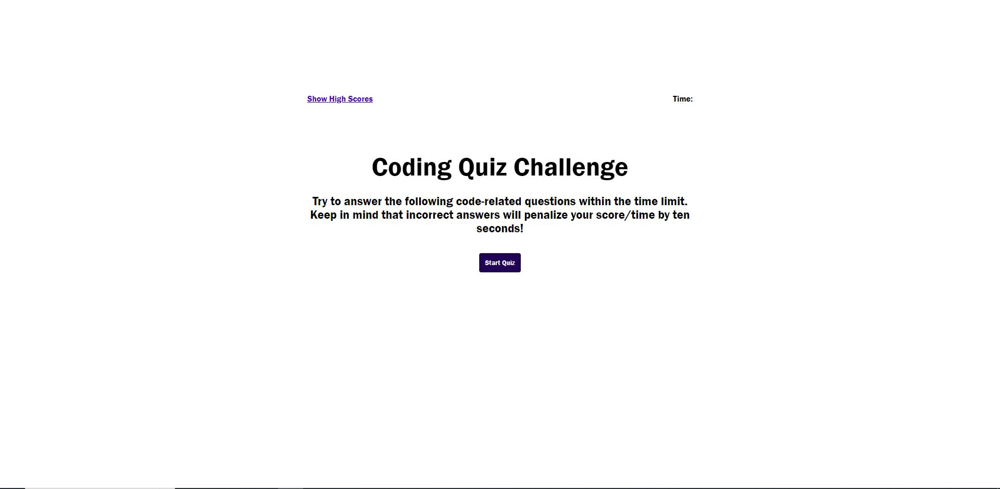

# Quiz-app

## Description

The Quiz-app is a web application where users can test their knowledge regarding JavaScript. The app is design to challenge the user's ability to answer several questions against time. It also features a clean user friendly interface, making it easy to interact and enjoy.

## Table of contents

N/A

## Installation

This is a web application. It does not require any software installation.

## Usage

The user is first presented with the start page quiz. It contains instructions about the rules of the quiz, as well as a high scores section located at the top-left of the page. Once, the "start quiz" button is pressed, then the user is taken into the following page where the questions begin. Each question has four multiple option answers, but only one is correct. When the user selects an answer then the page changes to the following question. If the incorrect answer is selected, ten seconds are taken from timer. At the end of the quiz, the score is based on the time left. The user then is presented with a "all done" section where initial can be saved with score.

## Credits

N/A